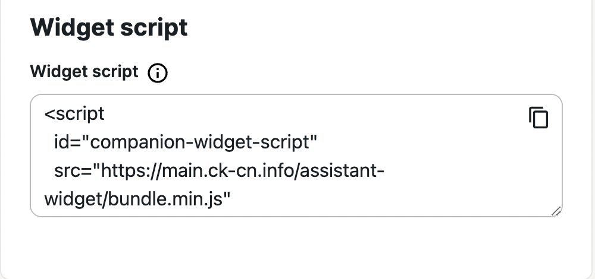
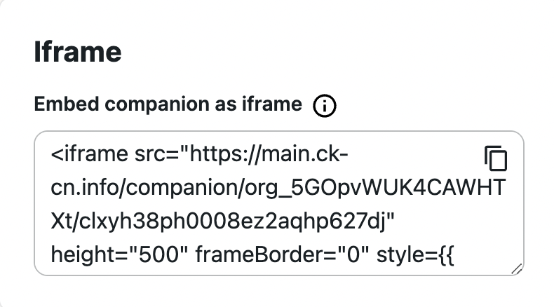

### Integration

On the bottom of the customization settings you can find integration options. There are two options of integration from the builder: widget or iframe.
With widget you can simply copy-paste embed code we provided and widget bubble will appear in right or left bottom corner of your web page. After clicking on Bubble your Companion will appear and you users will be ready to talk with him.



With Iframe things slightly different. You can copy paste embed code on your web page and iframe with Companion will appear. You can build logic of appearance of this iframe by your own or leave it as it is, so iframe will be drawn on page load.



### Advanced settings

Iframe or Widget integration from the box supports anonymous voice communication.

But we support few advanced settings to extend this.

For make chat more personal for users so Companion will remember some facts about user and previous interaction context you can provide `uniqueId` for iframe (`data-unique-id` for widget) so we can identify different end users, save some data and use it in future interaction. Value of this param can be any unique string less than **30 characters.**

# Widget integration & initialization

### Integration

> now Iframe integrates also using `<script …/>` tag:
> 
- script without attribute `data-embedding-element-id` will create a widget button that expands into the modal window with a companion iframe;

- script with a non-empty value of the attribute `data-embedding-element-id` will embed the iframe into the DOM element with an ID from this attribute:

```jsx
...
<script
  id="companion-widget-script"
	....
  data-embedding-element-id="companion-container"
></script>

...

<body>
    <h1>Test Companion iframe</h1>
    <div id="companion-container">
    </div>
</body>

...
```

## Initialization

The companion widget inside the iframe now requires initialization, which could be done using the method `initializeAssistant` provided by the `CompanionWidget` library, loaded alongside the integration script.

Before running the initialization method, the iframe should be added to the DOM, loaded properly, and ready for receiving the data. The iframe fires the event “`companion-iframe-loaded`” when properly loaded.

Initial data should be an empty object or contain variables as keys to match the prompt variables.

Example of how to initialize the Companion widget with data on the iframe loads:

```jsx
...
<script
  id="companion-widget-script"
	....
></script>
<script>
  window.addEventListener("companion-iframe-loaded", function() {
    CompanionWidget.initializeAssistant({
      userName: "Bob",
      memoryNotes: "Additional information about the user",
    });
  });
</script>

```

The method CompanionWidget.initializeAssistant could be called at any time later to provide fresh data to the companion.