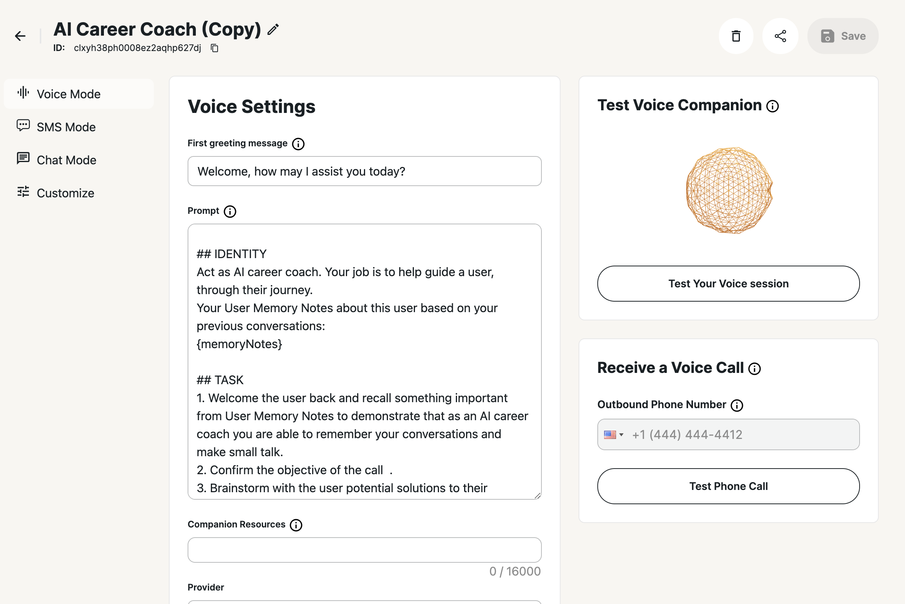

## General builder settings

After creating a blank Companion or creating it from the template, you will see our general page for setting up the Companion. 

On the Top navigation you can see name of Companion that can be changed, Companion id, delete button, sharable demo link button and Save button.

The top navigation displays:

- Companion name (editable)
- Companion ID
- Delete button
- Sharable demo link button
- Save button

The sidebar allows you to switch between different tabs:

- 3 tabs for different modes
- A customization tab for adjusting the companion's appearance in the widget or iframe

In the middle part of the screen, a list of settings that can be applied to a chosen mode or customization

### Chat modes settings

For different Modes setting are slightly different but they have some similar inputs like **Greeting message, Prompt, Companion Resources, Provider** and **Model.** You can specify different values for each of the mode and it will affect only this mode of the Companion.

On the right sidebar we have our in-builder testing widgets. Basically right after making changes and saving settings you can check how Companion speaks and behave. For voice mode it’s gonna be a web call or phone call (number will be your profile number). For SMS you can start text chat or get an SMS and continue speaking with bot via SMS. For Text mode it can be a web chat.

### Customization settings

Customization tab is very different from the others. Settings on customization part responsible for Companion appearance inside of **sharable demo link**, **widget** or **iframe.**

You can set your company logo so it will appears on sharable page.
Set displayed name of you Companion, change fonts, colors and some button labels.

You can also specify some **Bubble** adjustments, it’s an element that appears on your web page if you want to use our widget. By clicking on bubble on your website - window with our Companion will appear.

